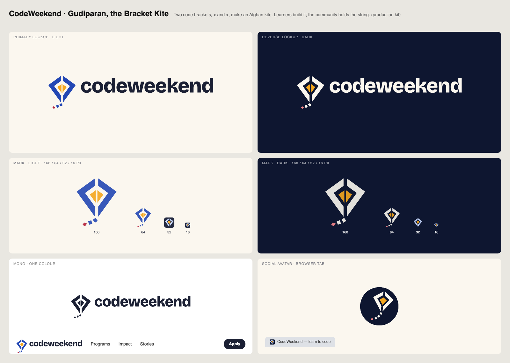
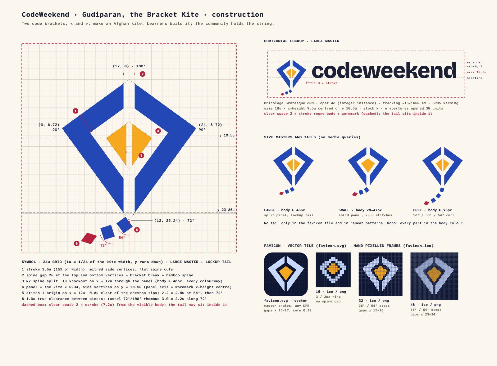
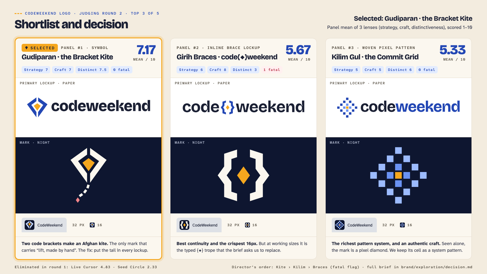
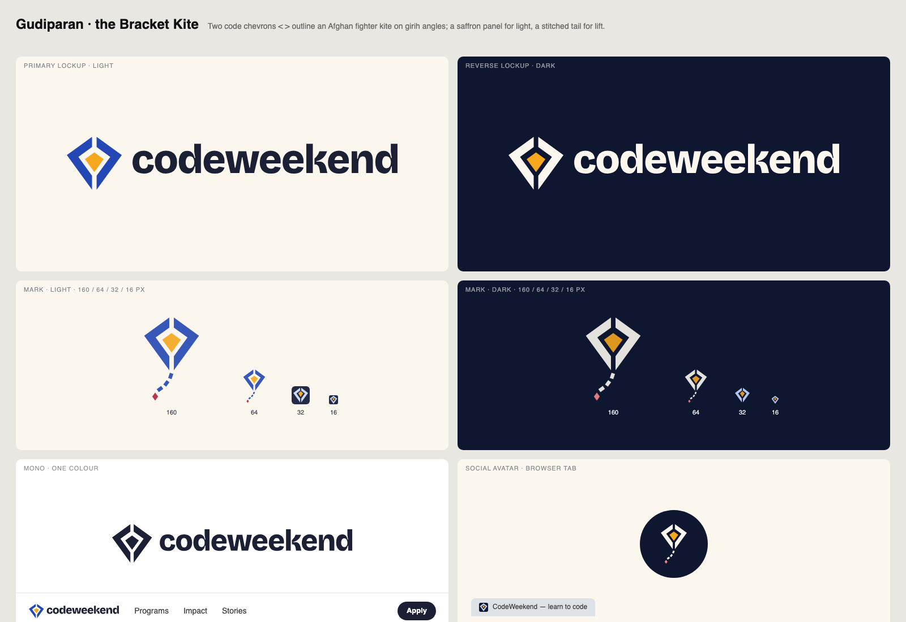
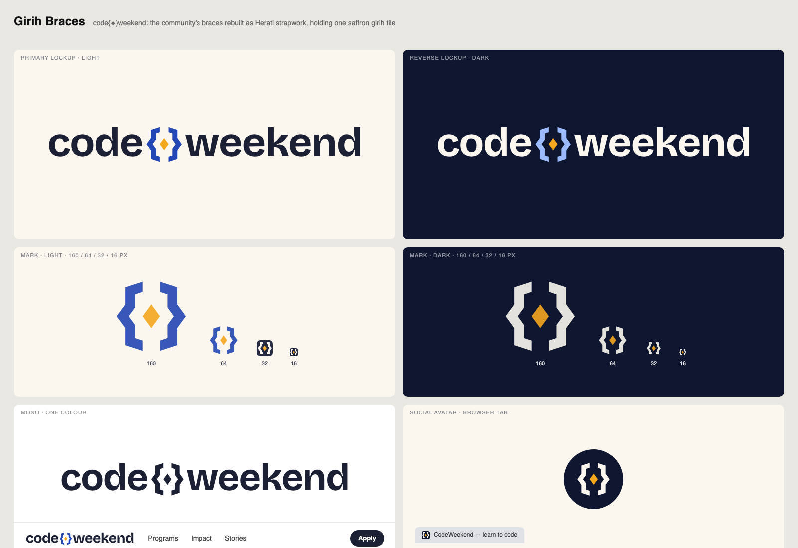
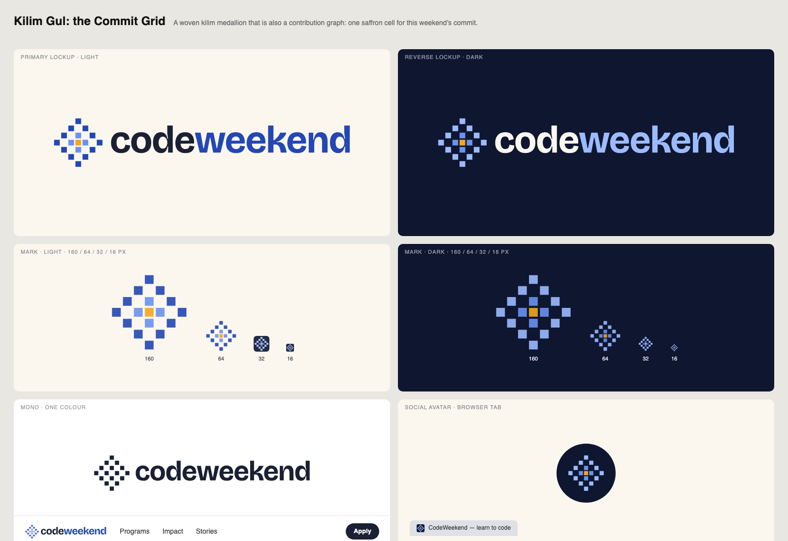
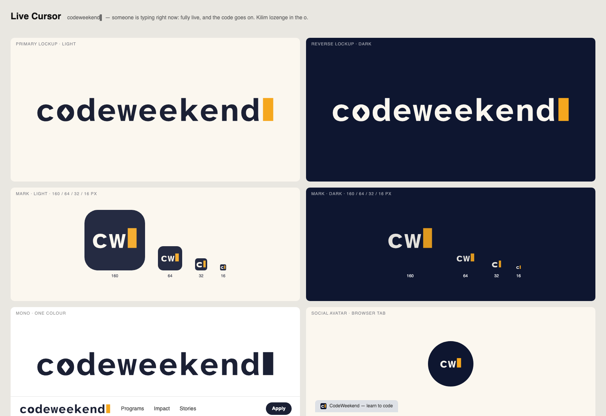
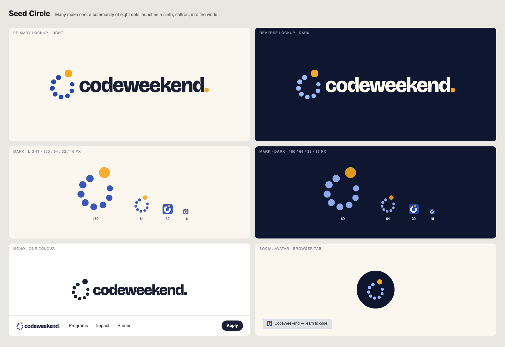

# CodeWeekend brand guidelines

How CodeWeekend looks and sounds, in one page. Start here. For depth, read:

- [`foundation.md`](foundation.md): the full strategy, every colour ramp and contrast ratio, the type scale, imagery and voice.
- [`logo/SPEC.md`](logo/SPEC.md): logo construction, size masters, nav CSS, favicon set and acceptance tests.
- [`tokens.css`](tokens.css): the CSS tokens. `assets/css/main.css` defines exactly these.

The public **Brand & press kit** is at [codeweekend.net/brand/](https://codeweekend.net/brand/). It has the logo downloads, colours, type, usage rules and the press contact.

**Contents:** [Idea](#1-the-idea) · [Logo](#2-the-logo-gudiparan-the-bracket-kite) · [Colour](#3-colour) · [Typography](#4-typography) · [Imagery](#5-imagery) · [Voice](#6-voice-and-tone) · [Files](#7-files) · [How the logo was chosen](#8-how-the-logo-was-chosen)

---

## 1. The idea

> **Code is a craft, passed hand to hand.**

**Lift, made by hand.** A *gudiparan*, the Afghan fighter kite, is made from simple parts with patience. It is flown on weekends, taught by older flyers to younger ones, and it rises because someone holds the string. CodeWeekend works the same way. Learners make the thing and fly it. Mentors, alumni and donors hold the string. Nobody is rescued; everybody builds.

| Role | Line | Where |
|---|---|---|
| Positioning | An inclusive community of developers. | Under the logo, OG cards, footer |
| Hero | Change your life, learn to code. | Home hero |
| Sign-off | Keep learning. Keep building. Together. | Footer, emails, end of decks |
| Craft line (max one per page) | One pattern at a time. | Program pages, curriculum |
| Continuity line | The code goes on. | Impact report, appeals, press |

**The name.** In running text, always **CodeWeekend**: one word, capital C and W. Only the logo wordmark is lowercase.

---

## 2. The logo: Gudiparan, the Bracket Kite



> **Two code brackets, `<` and `>`, make an Afghan kite. Learners build it; the community holds the string.**

- **The brackets** are two heavy chevrons on girih tile angles (108° top, 90° sides, 72° bottom).
- **The saffron panel** is the light. From a 48px body up, a thin spine splits it, like the kite's bamboo spar.
- **The spine gap** at the top and bottom is both the break between the brackets and the bamboo spine.
- **The stitched tail** is lift. It always curls left at girih angles, never straight down. Every lockup has a tail.
- Non-developers see a kite. Developers see a kite and a wink.

The kite is always a **made object**. Never draw a flyer, hands, ribbons, bows or a curly string. Never write "girls fly kites now". Never reference *The Kite Runner*.

**Alumni continuity.** The launch line is "code{ }weekend is now codeweekend: same community, since 2014." For six months the footer carries "since 2014, formerly code{ }weekend" in Atkinson Hyperlegible Mono. `{ }` lives on as a glyph in the kilim border band and in code-comment eyebrows.

### Which file to use

All public files are in [`../static/brand/`](../static/brand/) and served at `https://codeweekend.net/brand/<file>`.

| Need | Light ground | Dark ground (Night, Lapis-900, Lapis-600) |
|---|---|---|
| Logo, body 48px and up (print, press, layouts) | `logo.svg` | `logo-reverse.svg` |
| Logo, body 20–47px (nav, CMS headers, logo walls) | `logo-small.svg` | `logo-small-reverse.svg` |
| One colour (print, engraving, embroidery) | `logo-mono-ink.svg`, `logo-small-mono-ink.svg` | `logo-mono-white.svg`, `logo-small-mono-white.svg` |
| Square spaces (social, posters, OG) | `logo-stacked.svg`, `logo-stacked-mono-ink.svg` | `logo-stacked-reverse.svg`, `logo-stacked-mono-white.svg` |
| Mark alone, body 48px and up | `mark.svg`, `mark-mono.svg` | `mark-reverse.svg`, `mark-mono-white.svg` |
| Mark alone, body 20–47px | `mark-small.svg`, `mark-small-mono.svg` | `mark-small-reverse.svg`, `mark-small-mono-white.svg` |
| Hero, print, stickers (full tail, body 96px and up) | `mark-full.svg`, `mark-full-mono.svg` | `mark-full-reverse.svg` |
| Square slot (partner walls, app tiles) | `mark-square.svg` | `mark-square-reverse.svg` |
| Social avatar (has its own Night ground) | `avatar-flying.svg`, `social-avatar-800.png` (the default, tilted 8°) and `avatar.svg` (upright, for example for GitHub) | same files |
| PNG for people who cannot use SVG (transparent) | `logo-1200.png`, `logo-stacked-1200.png`, `mark-512.png` | `logo-reverse-1200.png`, `logo-stacked-reverse-1200.png`, `mark-reverse-512.png` |
| Inline in a Hugo template | [`logo/logo-inline.svg`](logo/logo-inline.svg), recoloured with `--logo-mark`, `--logo-panel`, `--logo-accent`, `--logo-word` | same file |

*Body* means the height of the kite outline, without the tail. There are two drawings, never a media query: the **Large master** (split panel) from a 48px body, and the **Small master** (solid panel, heavier tail) for 20–47px. Below 20px, use the favicon.



### Clear space and minimum sizes

- **Clear space** is 2 × stroke (7.2u, about 30% of the kite's width) on every side, measured from the kite body and the wordmark. The tail may sit inside it.
- **Minimum sizes:**

| Use | Screen | Print |
|---|---|---|
| Horizontal lockup | body 20px (`logo-small.svg`: 116px wide) | body 5mm (about 29mm wide) |
| Stacked lockup | body 48px (79px tall) | body 12mm |
| Mark alone | body 20px (`mark-small.svg`) | body 5mm |
| Full-tail mark, avatar art | body 96px | body 25mm |
| Favicon | 16px | — |

### In the site nav

Use the Small master inline (`layouts/partials/logo.html` already does): a 36px body is **208.87 × 59.06px**. Its box is symmetric about the wordmark's x-height, so plain `align-items: center` in the 64px bar is correct. No offsets. Keep `dir="ltr"` on the logo link, also on Dari and Pashto pages. On the Night footer, recolour it with `--logo-mark` and `--logo-word` set to Paper and `--logo-accent` to Pomegranate-300; the panel stays Saffron. Full numbers: [`logo/SPEC.md` §4](logo/SPEC.md#4-nav-recommended-sizes).

### Do and don't

| Do | Don't |
|---|---|
| Use the files as supplied | Redraw, retype, stretch, rotate, skew or re-space the logo |
| Use the reverse files on Night, Lapis-900 or Lapis-600 | Put the Lapis kite on Night (2.24:1) |
| Put the logo on Paper, white, Night or the Lapis grounds | Put it on a Saffron field or a busy photo |
| Keep the tail, curling left | Remove the tail, hang it straight down, or draw a ribbon or bow |
| Recolour only through the published files or the `--logo-*` variables | Add gradients, glows, shadows or outlines; use green anywhere |
| Sub-brands: the lockup plus an Atkinson Mono descriptor, such as `DEMO DAY 2026` | Build `demo{◆}day`-style constructions, or add a person, flyer or hands |

---

## 3. Colour

**Lapis** (Badakhshan lapis lazuli) is the brand. **Saffron** (Herat) is the light: the kite panel, the cursor, the one bright thing on a page. **Pomegranate** (Kandahar) is for celebration and urgency. **Firuza** (Herati tile turquoise) is a quiet detail colour. Surfaces are warm Paper; dark sections are Night, never pure black. All colour is flat.

| Colour | Token | Hex | Role |
|---|---|---|---|
| Lapis | `--lapis-600` | `#2347B4` | **Brand.** Logo, links, primary buttons, focus ring |
| Lapis dark | `--lapis-900` | `#0B1C4B` | Brand-dark section bands |
| Saffron | `--saffron-400` | `#F5A71E` | **Accent.** Kite panel, CTA fill and stats on dark, focus on dark. Never text on Paper |
| Saffron ink | `--saffron-800` | `#7B5100` | The only saffron-toned text on light (6.51:1) |
| Pomegranate | `--pomegranate-600` | `#B4223B` | Donate, Live and Enrolling badges, errors |
| Firuza | `--firuza-600` | `#116B82` | Tags, third data series |
| Paper | `--paper` | `#FBF7EF` | Default page background |
| Paper 2 | `--paper-2` | `#F3ECDF` | Alternate sections and cards |
| Sand | `--sand` | `#EADFCB` | Bands, table stripes, pattern tint |
| Stone | `--stone` | `#5F584C` | Muted text: captions, metadata |
| Ink | `--ink` | `#1B2034` | Body text and headings |
| Night | `--night` | `#0E1630` | Footer, dark sections, avatar and favicon ground |
| Mist | `--mist` | `#A9B1C6` | Muted text on dark |

Full ramps (Lapis 50–900, Saffron 50–900 and the rest) and every ratio are in [`foundation.md` §4](foundation.md#4-colour).

**Share of a layout:** Paper about 60%, Ink and Night about 22%, Lapis about 12%, Saffron 5% or less, Pomegranate 3% or less, Firuza 2% or less.

**Contrast (WCAG AA for all text).**
- Use: Ink on Paper 15.08 · Lapis-600 on Paper 7.47 · Stone on Paper 6.58 · Paper on Night 16.71 · Saffron-400 on Night 8.87 · Lapis-200 on Night 12.61 (links on dark) · Night on Saffron 8.87.
- Never: Saffron-400 text on Paper (1.88) · Lapis-600 on Night (2.24) · Pomegranate-600 on Night (2.75) · Firuza-600 on Night (2.93) · Stone on Night (2.54) · Mist on Paper (2.01).

**Cultural guardrails (non-negotiable).**
- **No green, anywhere.** Success states use Lapis with a check icon, so the black, red and green trio can never form.
- Never stack Lapis and Saffron as two equal horizontal fields: it reads as a flag. Saffron is always an accent.
- Never put Firuza in an equal band beside Pomegranate on Night or Ink, or build a Night, Pomegranate and Firuza stripe.
- No flags, no large decorative calligraphy, no religious geometry (eight-point stars, arches, mihrabs).

**In code.** Use the tokens, never raw hex. The old site tokens (`--sky-*`, `--sun-*`, `--cream*`, `--slate-*`, `--serif`, `--sans`, `--mono`, `--rtl-font`) are gone; the migration map is in [`foundation.md` §4](foundation.md#migration-map-from-the-current-site-tokens-assetscssmaincss).

---

## 4. Typography

| Role | Family | Weights |
|---|---|---|
| Display and the wordmark | **Bricolage Grotesque** (variable, opsz 12–96) | 500–800, no italic |
| Body and interface | **Atkinson Hyperlegible Next** | 400, 400 italic, 600, 700 |
| Labels, data and code | **Atkinson Hyperlegible Mono** | 400, 500, 600 |
| Dari and Pashto (RTL) | **Vazirmatn** | 400, 500, 700, 800 |

Atkinson Hyperlegible was designed by the Braille Institute so that easily confused characters (I l 1, O 0, rn m) look different. That matters for a learner reading her second or third language on a small phone, and twice as much in code.

```html
<link rel="preconnect" href="https://fonts.googleapis.com">
<link rel="preconnect" href="https://fonts.gstatic.com" crossorigin>
<link rel="stylesheet" href="https://fonts.googleapis.com/css2?family=Atkinson+Hyperlegible+Mono:wght@400;500;600&family=Atkinson+Hyperlegible+Next:ital,wght@0,400;0,600;0,700;1,400&family=Bricolage+Grotesque:opsz,wght@12..96,500..800&family=Vazirmatn:wght@400;500;700;800&display=swap">
```

| Style | Family and weight | Size / line-height | Tracking |
|---|---|---|---|
| H1 | Bricolage 760 | `clamp(40px, 6.2vw, 84px)` / 1.02 | -0.03em |
| H2 | Bricolage 720 | `clamp(32px, 4.2vw, 56px)` / 1.06 | -0.025em |
| H3 | Bricolage 650 | `clamp(22px, 2.4vw, 30px)` / 1.18 | -0.015em |
| H4 (card titles) | Atkinson Next 700 | 19–20px / 1.3 | 0 |
| Stat numeral | Bricolage 800 | `clamp(44px, 5vw, 72px)` / 1 | -0.03em |
| Lead | Atkinson Next 400 | `clamp(18px, 1.4vw, 21px)` / 1.55 | 0 |
| Body | Atkinson Next 400 | 17px, 18px from 1024px / 1.6, max 68ch | 0 |
| Small and caption | Atkinson Next 400 | 15px minimum / 1.5 | 0 |
| Button and nav | Atkinson Next 600 | 15–16px | 0.005em, sentence case |
| Eyebrow and label | Atkinson Mono 500 | 12.5px (never below 12px) | +0.12em, uppercase, led by a saffron stitched dash |
| Code | Atkinson Mono 400 | 15px / 1.6 | 0 |

- **Emphasis in headlines.** Bricolage has no italic. `em` in a heading is upright Lapis-600 with a Saffron-400 "stitch" underline. Body `em` uses Atkinson Next italic.
- **RTL.** Under `[dir=rtl]`, Vazirmatn replaces all three Latin families (headings 800, body 400, about 6% larger, line-height 1.8). Set `letter-spacing: 0` and `text-transform: none` everywhere, because letter-spacing breaks Arabic-script joining. The logo and code blocks stay `dir="ltr"`.

---

## 5. Imagery

**"Tile, Thread & Kite": diagrams of making, not pictures of people.** Flat vector on a hidden girih or kilim grid, small enough to inline as SVG.

1. Flat fills only: no gradients, glows, drop shadows, noise or glass. A sky is 3–5 stacked flat bands.
2. Two to four palette colours per piece. Night or Lapis give depth, Saffron is the single light source, Pomegranate or Firuza is one detail at most.
3. 2px strokes at 1×, 8px corner radius on windows and cards. Draw every piece for both Paper and Night.
4. Hero SVGs under about 25KB, spot illustrations under about 6KB.
5. **No faces, bodies or silhouettes of women and girls in brand illustration**, including hands, eyes and hijab-shaped outlines. Story "portraits" are *Her Kite* tiles: a kite patterned from a hash of a consented first name, with her initial and an icon of what she built.
6. Real photos of learners appear only with explicit, informed, revocable consent, never as decoration. Frame them square, 14px radius, 1px `--line` border, no filters or blur.
7. Product screenshots are the proof: show them in a flat browser or phone frame.

**Never:** burqa or veil imagery · chains, cages, barbed wire, broken pencils, candles in darkness · "saviour" hands · flags or black, red and green · mosques, crescents, arches, mihrabs, eight-point stars, decorative calligraphy · guns or rubble · glowing circuit brains, purple-blue tech gradients, globe networks · stock laptops in cafés.

Pattern kit (kilim "running water" divider, girih-rhombus bullets, pomegranate-seed progress dots, commit grid) and the hero and OG card briefs: [`foundation.md` §6](foundation.md#6-imagery-tile-thread--kite).

---

## 6. Voice and tone

**A warm senior developer on a Saturday morning:** part mentor, part older sister. Plain, direct, encouraging, specific.

1. **Plain English first** (CEFR B1). Sentences under about 20 words, active verbs, no idioms or puns: they break in Google Translate to Dari and Pashto.
2. **Craft verbs, not hype verbs.** Build, make, practise, ship, finish. Never disrupt, revolutionise, leverage, ninja, rockstar or 10x.
3. **Numbers over adjectives.** "30 graduates showed 30 working apps after 12 weeks", not "amazing results".
4. **The learner is the subject of the sentence.** "Mahdia built a clinic-booking app." Never "we saved", "voiceless" or "beneficiaries".
5. **Name the education ban once, plainly, when relevant**, then move to what learners are doing. No trauma detail, no "plight".
6. **Developer idiom is seasoning:** at most one per section (`// demo day` eyebrows, `v2014 → v2026` timelines). Never a fake terminal in body copy.
7. **At most one craft metaphor per page.** Never "ancient", "mystical" or "land of".
8. **First names only, and only with consent.** Never a detail that could locate a learner.

| Don't | Do |
|---|---|
| "Empowering voiceless Afghan girls to escape darkness." | "Afghan women are building web apps. We teach them, live and free." |
| "Amazing results this year!!!" | "30 graduates. 30 working products. One stage." |
| "Help us save a girl's education." | "Fund a seat in the 2026 cohort." |

Tone by audience (learners, donors, mentors, employers, press): [`foundation.md` §3](foundation.md#3-voice-and-tone).

---

## 7. Files

```
brand/                          # this folder: guidelines and sources (not published)
├── README.md                   # you are here
├── foundation.md               # strategy, palette, type, imagery, voice
├── tokens.css                  # the token block that assets/css/main.css :root defines
├── logo/
│   ├── SPEC.md                 # logo production spec
│   ├── logo-inline.svg         # Small-master lockup for inline use (--logo-* colour hooks)
│   ├── sheet.png               # contact sheet
│   └── construction.png        # grid and geometry
└── exploration/                # how the logo was chosen (section 8)

static/brand/                   # public logo kit, served at /brand/<file>
static/favicon.svg, favicon.ico, apple-touch-icon.png, icon-192.png, icon-512.png,
       icon-maskable-512.png, site.webmanifest

content/brand/_index.md         # the /brand/ press-kit page: downloads list and palette in front matter
layouts/brand/list.html         # its template
assets/css/brand-kit.css        # its styles (brand tokens only)
```

**Adding a file to the public kit.** Put it in `static/brand/`, then list it under `downloads` in `content/brand/_index.md`. The build fails if a listed file is missing.

**PNG exports.** `logo-1200.png`, `logo-reverse-1200.png`, `logo-stacked-1200.png`, `logo-stacked-reverse-1200.png`, `mark-512.png` and `mark-reverse-512.png` are rendered from the SVGs with a transparent background, at exactly those pixel sizes. If the logo SVGs ever change, re-render them.

**Changing the logo.** The SVGs were generated by one build script so that every file stays in sync. It lives in [`logo/src/`](logo/src/): run `python3 brand/logo/src/build.py` (needs Python 3 with Pillow and fontTools, plus Google Chrome for PNG renders; `--svg` for SVGs only, `--qa` to add the acceptance tests). Output lands in `brand/logo/`; copy the production files into `static/` and `static/brand/`. Do not hand-edit one SVG; regenerate the set (see [`logo/SPEC.md` §8](logo/SPEC.md#8-file-index)).

---

## 8. How the logo was chosen

The old `code{ }weekend` brace wordmark was generic: any coding club could use it. The brief asked for a mark that is ownable, warm, credible and specific to CodeWeekend, works at 16px, in light and dark, in one colour and in a 64px nav, and always reads left to right.

**1. Five concepts, five constructions.** Each was drawn as a full contact sheet (lockup, reverse, mark at 160 to 16px, mono, avatar, nav).

| Concept | Construction | Idea |
|---|---|---|
| **Gudiparan, the Bracket Kite** | Symbol | `<` and `>` form an Afghan fighter kite on girih angles |
| **Girih Braces** `code{◆}weekend` | Inline brace lockup | The community's `{ }` rebuilt as Herati strapwork around a saffron tile |
| **Kilim Gul, the Commit Grid** | Woven pixel pattern | A kilim medallion that is also a contribution graph |
| **Live Cursor** `codeweekend▌` | Pure type | A mono wordmark with a saffron block cursor |
| **Seed Circle** | Community dots | Eight dots form a "c"; a ninth launches out |

**2. An independent judging panel with three lenses.** Strategy (does it carry the brand idea and the audiences?), craft (does it hold at 16px, in mono, in the nav?) and distinctiveness (could anyone else own it? what is it mistaken for?). Each lens scored 1–10 and could raise a fatal flag. Live Cursor (4.83) and Seed Circle (2.33) left in round 1.

**3. Shortlist of three.**

| Concept | Strategy | Craft | Distinctiveness | Fatal flags | Panel mean |
|---|---|---|---|---|---|
| **Bracket Kite** | 7 | 7 | 7.5 | 0 | **7.17** |
| Girih Braces | 6 | 8 | 3 | 1 | 5.67 |
| Kilim Commit Grid | 5 | 5 | 6 | 0 | 5.33 |



**4. Decision: the Bracket Kite.** It is the only mark that carries the brand idea (lift, made by hand) and not only "code". It is a specific Afghan object rather than a programming glyph, so it can be owned, and it seeds the whole imagery system: the hero sky, the *Her Kite* tiles, the Demo Day kite wall, the OG card. Its weaknesses (the kite read depended on the tail, a soft favicon, a gem-like mono) were about execution, and refinement fixed them: a tail in every lockup, a spine through the panel, two size masters and a redrawn favicon set. The other two failed on concept: Girih Braces carried a fatal flag because at working sizes it *is* the typed `{◆}` trope the brief asked us to replace; the Kilim grid alone reads as a generic pixel diamond, with plus-sign and crypto misreads. The kilim cell lives on as a supporting pattern.

The full reasoning and the refinement brief (R1–R11) are in [`exploration/decision.md`](exploration/decision.md). The production result is [`logo/SPEC.md`](logo/SPEC.md).

**Still open:** acceptance test 1, the misread test. A fresh three-person panel, who have not seen the work, should name "kite" first and unprompted for the one-colour mark at 80px and 28px ([`logo/SPEC.md` §9](logo/SPEC.md#9-acceptance-tests)).

### The five concept sheets

| | |
|---|---|
|  |  |
| **Bracket Kite** (selected, 7.17) | **Girih Braces** (5.67, one fatal flag) |
|  |  |
| **Kilim Commit Grid** (5.33) | **Live Cursor** (4.83, round 1) |
|  | |
| **Seed Circle** (2.33, round 1) | |
